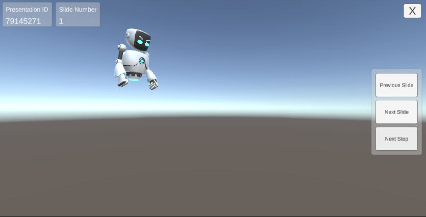

# ANPrez SDK

## Compatible Unity Versions
Unity 2020.3.11f1, 2021.2.2f1

ANPrez SDK can be downloaded by either a UnityPackage or directly from the Package Manager using the SDK's git URL.

## Steps to setup ANPrez SDK in your Unity project
### Common steps

1.  Create an empty project in Unity

2.  Import TextMeshPro (If not already present) in to the project by going to “Window” -> “TextMeshPro” -> “Import TMP Essential Resources”

3.  Click Import when the import dialog opens

4. Restart the Unity Editor to finish TextMeshPro configuration

5. Import "Burst" package from PackageManager. Change the "Packages" to "UnityRegistry" like in below image and click install.

## Using ANPrezSDK.unitypackage

Import “PrezSDK.unitypackage” into the project by either drag and drop or Assets-Import Package-Custom Package and selecting the package. When the import dialog opens, make sure everything is selected and click “Import”

## Using Package Manager

Users can import ANPrezSDK in to their projects using the git URL i.e [https://github.com/AfterNow/ANPrezSDK.git](https://www.google.com/url?q=https://github.com/AfterNow/ANPrezSDK.git&sa=D&source=editors&ust=1644002252952449&usg=AOvVaw0EhSYsVmkgdTDpso5PGuR-)

In Unity, go to Window-Package Manager and click on the ‘+’ button. Here you will see options to load the package using

### **Add package from disk**

If the user has downloaded the SDK directly to their computer, select ‘package.json’ from Packages/com.afternow.anprezsdk/

### **Add package from tarball**

Select the ‘ANPrezSDK.tgz’ or ‘ANPrezSDK.tar.gz’ file

### **Add package from git URL**

Insert the git URL into the field. Make sure the link is valid by opening in the web browser once. Click ‘Add’ after inserting the URL.

Once the package is imported using any of the above mentioned methods, package details will be visible in the Package Manager like in the image below.

In the above image the User can see

*View Documentation* - Clicking this opens up web browser displaying the documentation of the SDK

*View Changelog* - Clicking this opens up the SDK’s changelog in a web browser where User can see the changes provided in the new version of SDK.

*View Licenses* - Clicking this opens up a license document

*Description* - Description about the purpose of the SDK and what can it offer

*Installed from* - Git URL using which the package has been downloaded

*Sample Projects* - Links to download sample projects  provided. User can download them to respective to their platform of choice

Once the package is imported successfully, you will see the package contents in the “AN-PrezSDK“ folder like in the below image

Open *ExampleScene* scene which is in Assets\AN-PrezSDK\Runtime\Examples\UI_Control

This is how the hierarchy of the *ExampleScene* scene looks like :

The gameobject **PrezSDKManager** has a script called **PrezSDKManager**. This script is responsible for loading the presentation. If you select the **PrezSDKManager** gameobject, you can see there are some fields in the **PrezSDKManager** component in the inspector panel.

## UI
The UI inside the SDK consists of 3 types of menus

### User Login Menu

### Load Presentation Menu

### Play Presentation Menu

### UI Elements

Presentation ID - The 8-digit code unique to any presentation created on ANPrez web portal

Load Presentation - Loads the presentation

Previous Slide - Play previous slide

Next Slide - Play next slide

Next Step \- Play next animation in the current slide

Presentation ID - Displays ID of the loaded presentation

Current Slide - Displays current slide serial number

Quit \- Quits presentation and returns to the login UI

## Usage
* Login using the user credentials
* Go to Play mode. Enter a presentation ID in the “Presentation ID” input field and hit “Load Presentation” button

* Navigate through the presentation using the ‘Previous Slide’, ‘Next Slide’ and ‘Next Step’ buttons.

Issue Handling
==============

1.  In case of any errors regarding the InputSystem, make sure to select either “Input Manager (Old)” or “Both” in Player Settings -> Other Settings -> Configuration -> Active Input Handling. Refer to the below image.

2. Incase if any UI elements seems to be not working, make sure to import the **TextMeshPro Essentials** package from the Window->TextMeshPro->Import TMP Essential Resources wizard 
(This wizard will also automatically opens when the user drag and drops the 'ExampleController' prefab in to the scene)

3. Incase if the UI seems to be not responding to user clicks, make sure there is an 'EventSystem' in the scene if not already present.
