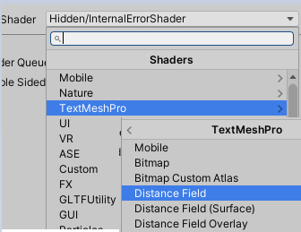
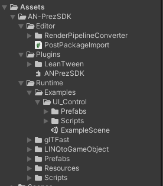

ANPrez SDK
============

Unity 2020.3.11f1, 2021.2.2f1

ANPrez SDK can be downloaded by either a UnityPackage or directly from the Package Manager.

1.  Create an empty project in Unity

2.  Import TextMeshPro (If not already present) in to the project by going to “Window” -> “TextMeshPro” -> “Import TMP Essential Resources”

3.  Search for ‘Brandon-Regular Material’ in the Project. If the shader is pink i.e ‘Hidden/InternalErrorShader’ like in the below Fig 1, then click on dropdown and select ‘TextMeshPro/DistanceField’ like in Fig 2.

Fig 1

Fig 2

4.  Click Import when the import dialog opens

Steps to import ANPrez SDK
==========================

Using ANPrezSDK.unitypackage
----------------------------

5.  Import “PrezSDK.unitypackage” into the project by either drag and drop or Assets-Import Package-Custom Package and selecting the package. When the import dialog opens, make sure everything is selected and click “Import”

Using Package Manager
---------------------

Users can import ANPrezSDK in to their projects using the git URL i.e [https://github.com/AfterNow/ANPrezSDK.git](https://www.google.com/url?q=https://github.com/AfterNow/ANPrezSDK.git&sa=D&source=editors&ust=1644002252952449&usg=AOvVaw0EhSYsVmkgdTDpso5PGuR-)

6.  In Unity, go to Window-Package Manager and click on the ‘+’ button. Here you will see options to load the package using

1.  #### Add package from disk
    

If the user has downloaded the SDK directly to their computer, select ‘package.json’ from Packages/com.afternow.anprezsdk/

2.  #### Add package from tarball
    

Select the ‘ANPrezSDK.tgz’ or ‘ANPrezSDK.tar.gz’ file

3.  #### Add package from git URL
    

Insert the git URL into the field. Make sure the link is valid by opening in the web browser once. Click ‘Add’ after inserting the URL.

7.  Once the package is imported using any of the above mentioned methods, package details will be visible in the Package Manager like in the image below.

8.  In the above image the User can see

View Documentation - Clicking this opens up web browser displaying the documentation of the SDK

View Changelog - Clicking this opens up the SDK’s changelog in a web browser where User can see the changes provided in the new version of SDK.

View Licenses - Clicking this opens up a license document

Description - Description about the purpose of the SDK and what can it offer

Installed from - Git URL using which the package has been downloaded

Sample Projects - Links to download sample projects  provided. User can download them to respective to their platform of choice

9.  Once the package is imported successfully, you will see the package contents in the “AN-PrezSDK“ folder like in the below image

10.  Open “SDK” scene which is in Assets\\Scripts\\SDK\\Unity\\Scenes

11.  This is how the hierarchy of the “SDK” scene looks like :

12.  The gameobject “AnPrezSDK” has a script called “PrezSDKManager”. This script is responsible for loading the presentation. If you select the “AnPrezSDK” gameobject, you can see there are some fields in the “PrezSDKManager” component in the inspector panel.

13.  The UI for importing a presentation looks like this in “SDK” scene :

### UI Elements

Presentation ID - The 8-digit code unique to any presentation created on ANPrez web portal

Load Presentation - Loads the presentation

Previous Slide - Play previous slide

Next Slide - Play next slide

Next Step \- Play next animation in the current slide

Presentation ID - Displays ID of the loaded presentation

Current Slide - Displays current slide serial number

Quit \- Quits presentation and returns to the login UI

14.  Go to Play mode. Enter a presentation ID in the “Presentation ID” input field and hit “Load Presentation” button

15.  Navigate through the presentation using the ‘Previous Slide’, ‘Next Slide’ and ‘Next Step’ buttons.

Issue Handling
==============

1.  In case of any errors regarding the InputSystem, make sure to select either “Input Manager (Old)” or “Both” in Player Settings -> Other Settings -> Configuration -> Active Input Handling. Refer to the below image.

2.  If using Universal Render Pipeline (URP) in the project and if any glb models turns purple on Quest, try adding the below shaders from the glTFast folder of the SDK (Fig 1) to the ‘Always Included Shaders’ list of ‘Graphics’ settings in Unity (Fig 2).

Fig 1

Fig 2